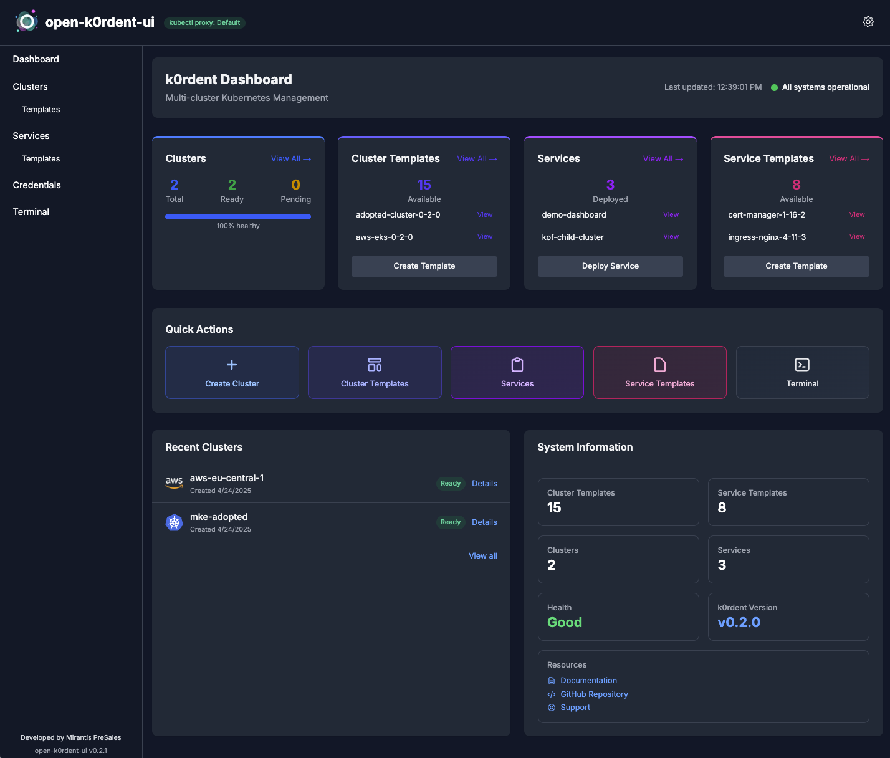

# {{{ docsVersionInfo.k0rdentName }}} UI

**{{{ docsVersionInfo.k0rdentName }}} UI** is a web-based interface that simplifies the day-to-day management of Kubernetes infrastructure. Designed to run directly within your k0rdent management cluster, it gives you a powerful yet intuitive visual experience for deploying, observing, and maintaining clusters and services across multiple environments. Rather than manually creating `ClusterTemplate` and `ServiceTemplate` objects, you can create clusters and serivces directly from the UI.

## Why Use {{{ docsVersionInfo.k0rdentName }}} UI

Managing Kubernetes clusters and services at scale can be inherently complex, especially when balancing declarative infrastructure, GitOps workflows, and multi-cloud or edge deployments. The {{{ docsVersionInfo.k0rdentName }}} UI is built to reduce that complexity and expose the key capabilities of the {{{ docsVersionInfo.k0rdentName }}} control plane, providing:

* **Operational Visibility**: Get a real-time overview of your clusters and deployments, including health, status, and geographic distribution.
* **Declarative Accessibility**: Manage `ServiceTemplate`, `ClusterDeployment`, and Addon objects without needing to write raw YAML.
* **Secure Access**: Supports basic authentication out of the box, with the ability to add OIDC, making it safe for internal platform teams.

## Core Features

{{{ docsVersionInfo.k0rdentName }}} UI includes:

*  **Dashboard**: At-a-glance status of your entire {{{ docsVersionInfo.k0rdentName }}}-managed footprint
*  **Cluster Map**: Real-time map of deployed clusters and their health status
*  **Addon Catalog** (experimental): Browse and apply platform extensions
*  **Service Management**: Deploy and monitor services across clusters
*  **Template Management**: Create and control reusable cluster/service templates
*  **Credential Viewer**: Inspect and manage existing infrastructure credentials
*  **Embedded Terminal**: Run `kubectl` commands in context
*  **Authentication**: Role-based access with basic auth support

## Get Started

* [Configure k0rdent UI](k0rdent-ui-config.md)
* [Use k0rdent UI](k0rdent-ui-usage.md)

