# Using the {{{ docsVersionInfo.k0rdentName }}} UI

The {{{ docsVersionInfo.k0rdentName }}} offers a streamlined, visual interface for managing Kubernetes clusters and services at scale. It’s designed for platform engineers and operators who need a consistent way to manage declarative infrastructure, track changes, operate multi-cluster workloads, and monitor system health with high visibility. This guide takes you through all of the steps and concepts you need to use the UI effectively, from creating clusters to deploying workloads.

Key capabilities include:

* **Dashboard**: Real-time overview of cluster state, service sync status, and health indicators.
* **Cluster Management**: Template-based creation, editing, and deletion of clusters; support for adopting existing clusters.
* **Multicluster Services**: Deploy and manage services across multiple clusters from a single service template with tagging, sync control, and drift detection.
* **Credentials**: View infrastructure and access credentials required for operations (must be created outside the UI).
* **Addons**: Deploy cluster-level tools using service templates from a pre-integrated catalog.
* **Templates**: Reusable, versioned blueprints for both clusters and services; includes YAML editing, version control, and audit trails.

The guide walks through these workflows in detail with UI screenshots, showing you how to use the platform effectively for declarative, multi-cluster Kubernetes operations.

Let's start with the dashboard.

## UI Dashboard

At any given time, {{{ docsVersionInfo.k0rdentName }}} manages a significant number of objects, so it's handy to have a single window in which you can observe and manage most of them.

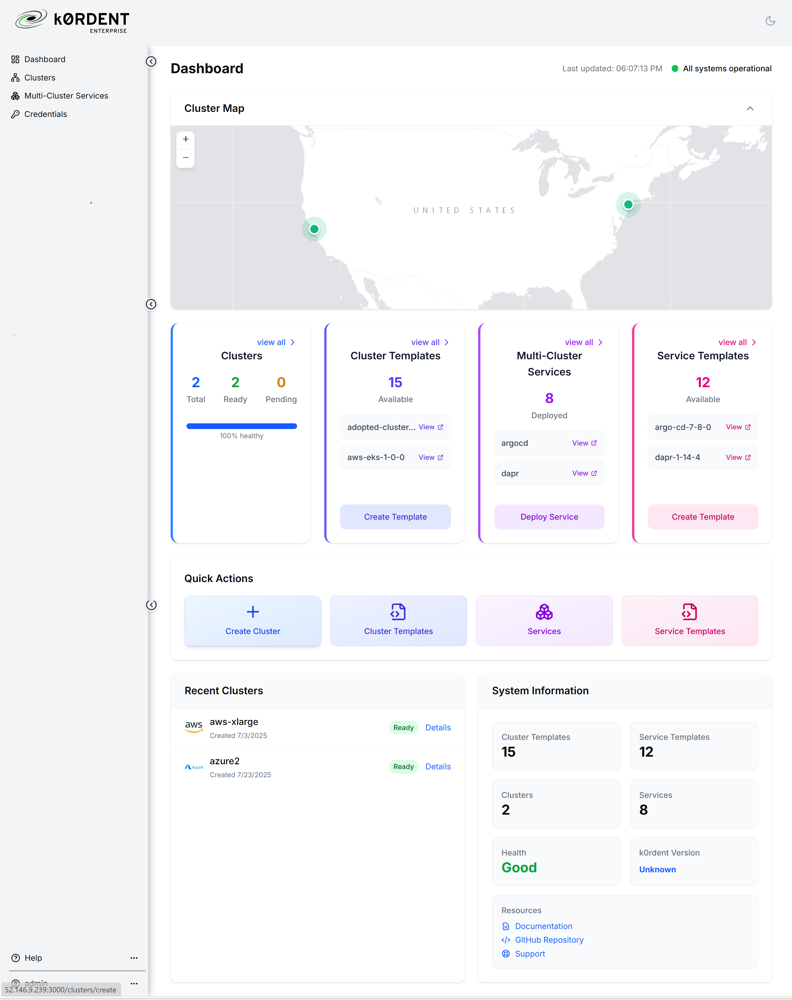

The dashboard serves as the entry point to the platform. It provides an at-a-glance view of the current system state: number of clusters, active service templates, synchronization status, and health of underlying infrastructure and existing clusters. 

You can use this screen to identify problem areas and navigate quickly to deeper management views.

## Working with Clusters

Of course the main point of {{{ docsVersionInfo.k0rdentName }}} is to create and manage Kubernetes clusters. The {{{ docsVersionInfo.k0rdentName }}} UI enables you to manage the full lifecycle of clusters, including creation of new clusters, adoption of existing clusters, updating clusters, and decommissioning them, all through templates and declarative configuration.

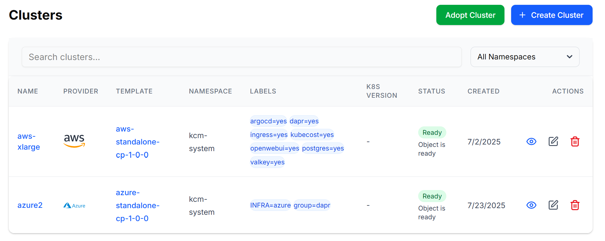

When you click the `Clusters` button in the left-hand pane, you see a view that lists all clusters currently managed by {{{ docsVersionInfo.k0rdentName }}}, along with basic information such as the infrastructure provider, template, tags, and status.

### Create a New ClusterDeployment

To have {{{ docsVersionInfo.k0rdentName }}} create or deploy a new cluster, click the "+ Create Cluster" button.

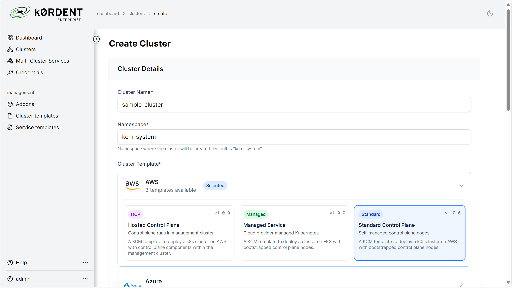

Start by naming the cluster; the cluster name should include only lowercase letters, numbers, and either `-` or `.` and must start and end with a letter or a number.  You can place the cluster in the `kcm-system` namespace, but it is good practice to limit users to accessing other namespaces.

Next. choose a `ClusterTemplate` on which to base the cluster. You will see all of the available templates listed; choose a template based on the provider for which you have credentials.

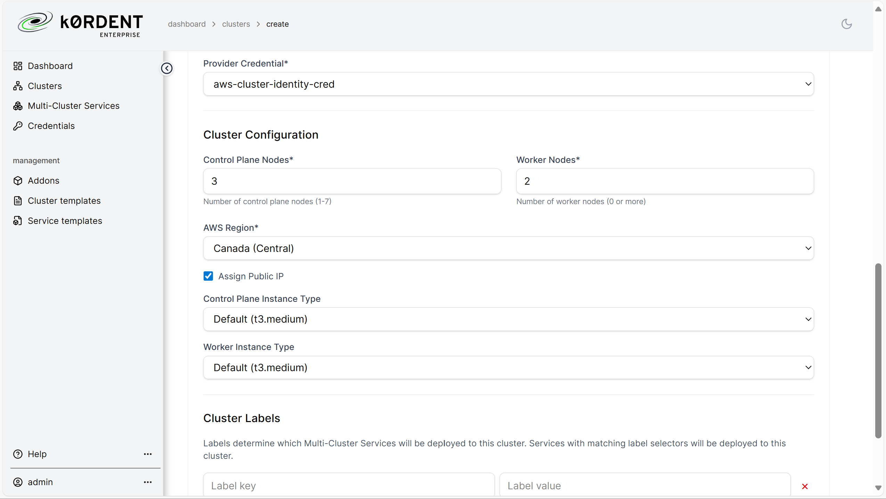

Choose the `Credential` for the relevant infrastructure. Note that you can't create credentials in the UI; you need to [create them ahead of time](k0rdent-ui-config.md#cluster-credentials) and select them from this form.

Specify the cluster size and, if necessary, the `Region` or other provider-specific parameters, as well as the machine size.  If you are accessing the cluster from the public internet, don't forget to specify `Assign Public IP`.

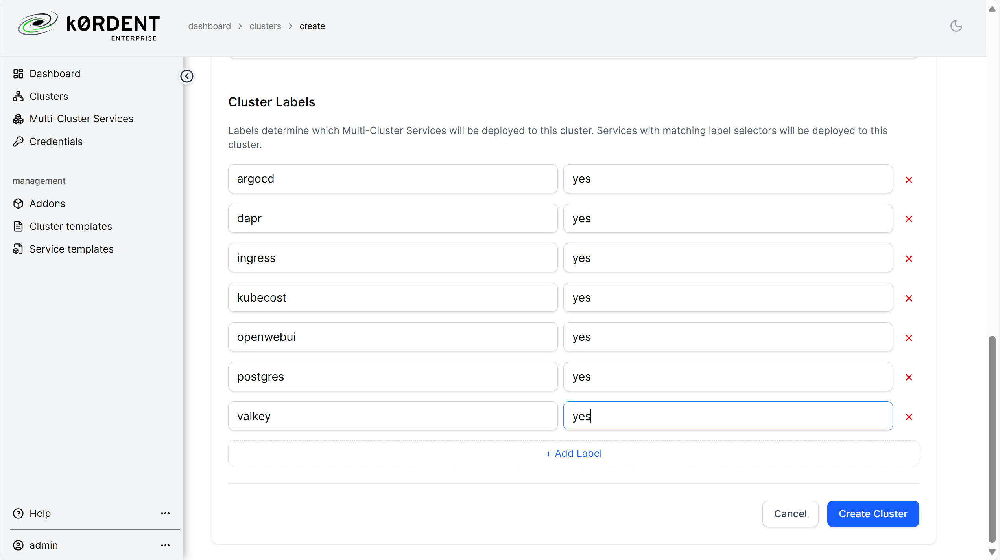

Set tags and their values. Later, when creating workload services, you can specify the tags and values a cluster must have in order to run that particular workload.

Click `Create Cluster`.

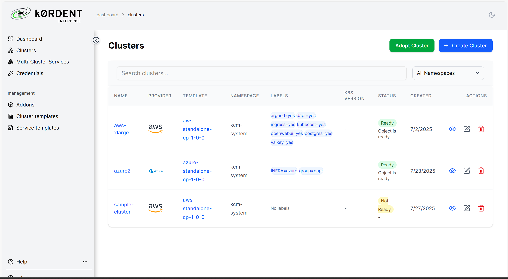

You can follow the status of the deployment from the `Clusters` page.

  
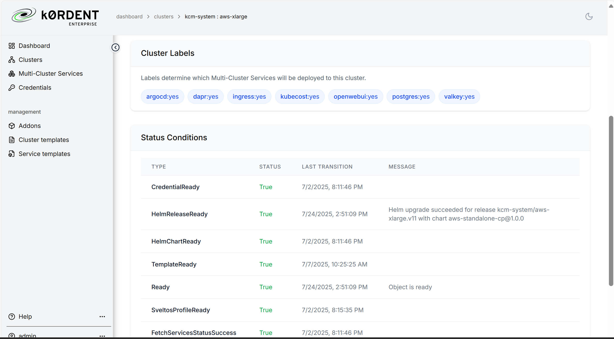

You can also click on the cluster name to get more details about the cluster.  This includes both configuration information and log events as the cluster is created.

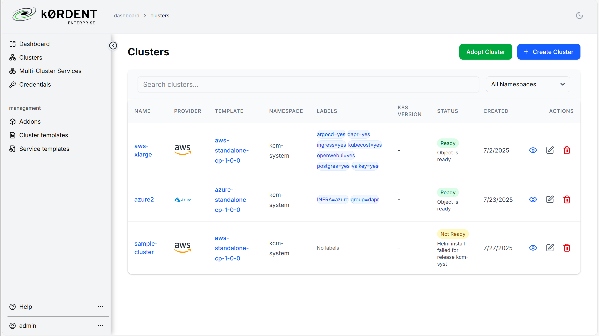

To edit the configuration of an existing cluster, click the edit link.

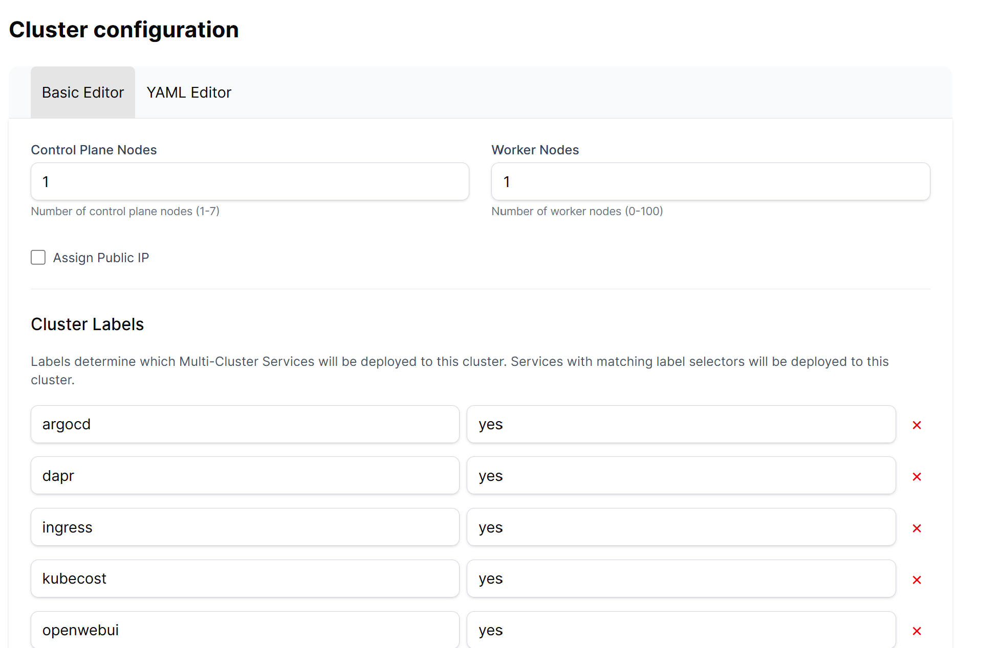

You can then use the form to edit basic information about the configuration.

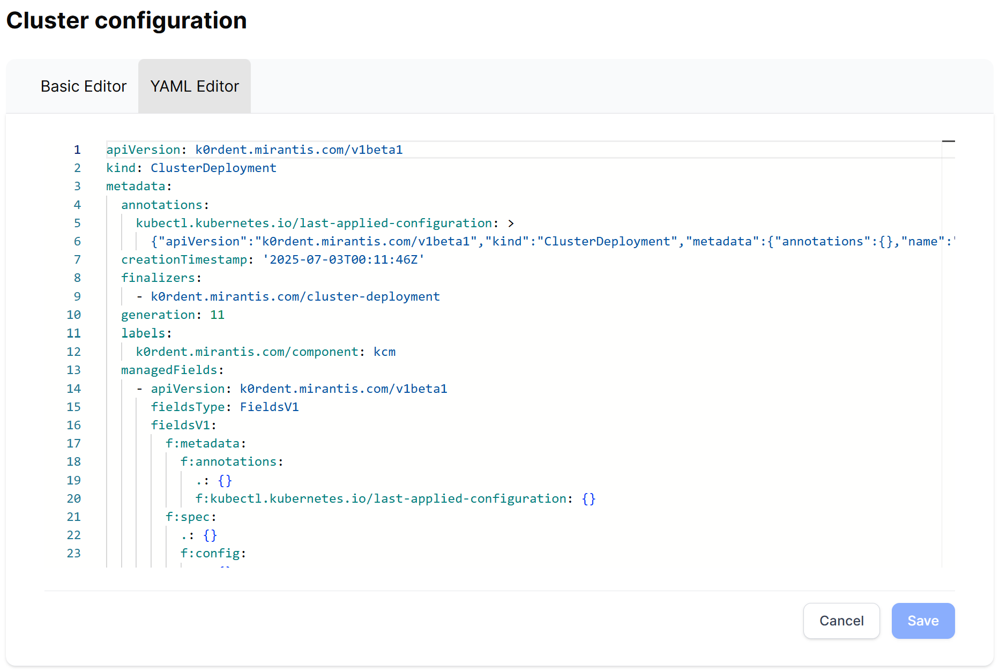

You can also edit the YAML directly to make more extensive changes.

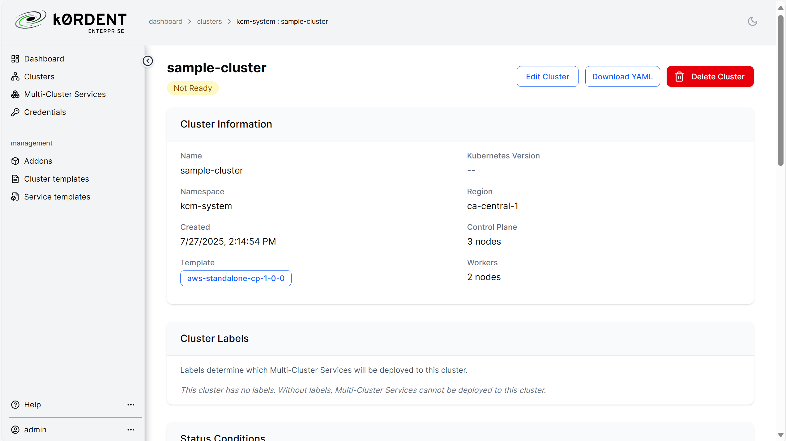

From the cluster information page, you can also click `Delete Cluster` to start the termination process.  When you delete a cluster, {{{ docsVersionInfo.k0rdentName }}} deletes the machines associated with the cluster before deleting the reference in Kubernetes.

### Adopting a cluster

While {{{ docsVersionInfo.k0rdentName }}} focuses on creating clusters, you will often want to use it to manage clusters that already exist. For example, {{{ docsVersionInfo.k0rdentName }}} makes it simple to add services to a cluster.

To enable {{{ docsVersionInfo.k0rdentName }}} to manage an existing cluster, you adopt that cluster. To begin that process, first make sure you have the appropriate [`Credential`](k0rdent-ui-config.md#credentials) created to manage the cluster, then click the `Adopt Cluster` button.

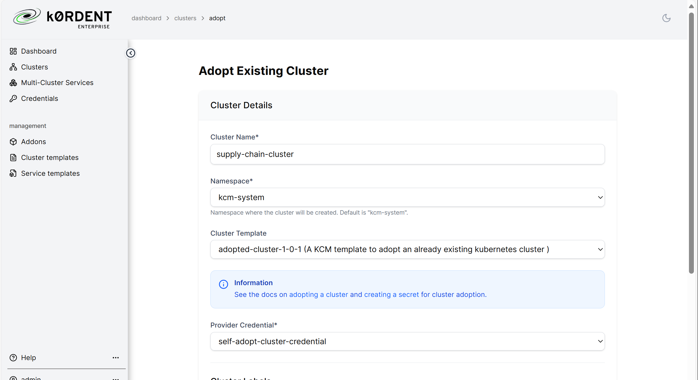
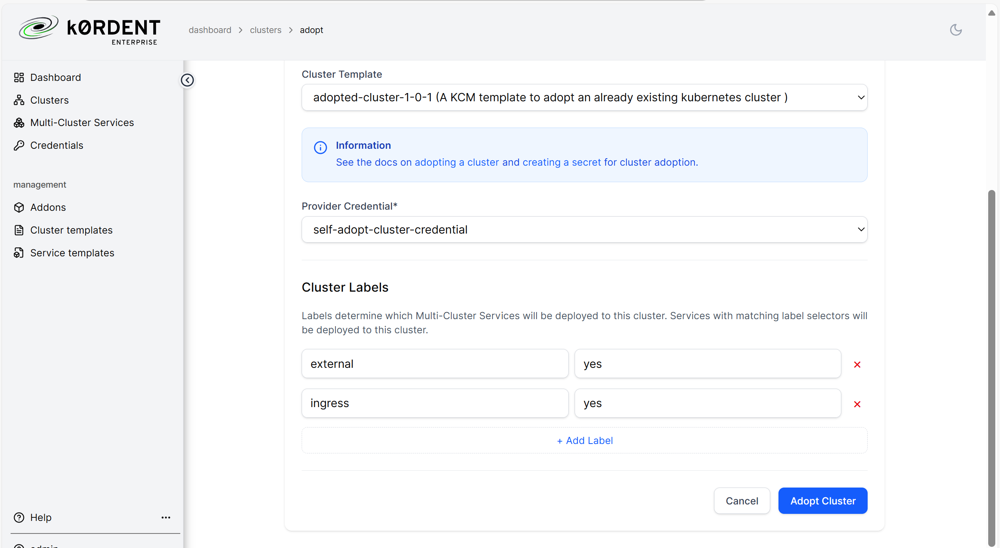

Enter the name of the cluster; this is an arbitrary name used just for your reference.

Just as with creating a new cluster, you can use the `kcm-system` namespace, but you should consider creating it elsewhere.

Regardless of the infrastructure on which the adopted cluster lives, use the "adopted" `ClusterTemplate`; management is handled via the `KUBECONFIG` specified in the adoption `Credential`.  The provider credentials are handled separately, in the `ProviderCredential` field.  Again, you must [create this `Credential`](k0rdent-ui-config.md#credentials) ahead of time.

Even though you're adopting an existing cluster, you can add tags to help {{{ docsVersionInfo.k0rdentName }}} provision workloads to the appropriate cluster.

Finally, click `Adopt Cluster` to start the process.

## Multicluster Services

{{{ docsVersionInfo.k0rdentName }}} makes it easy to deploy services across one or more clusters from a single source template, ensuring consistency and centralized tracking.  

Keep in mind that in the context of {{{ docsVersionInfo.k0rdentName }}}, a `Service` is a one or more applications deployed with Helm according to a Service Template, which is separate from a Kubernetes `Service` object.

Click `Multicluster Services` to get a list of applications that have been installed on child clusters. 

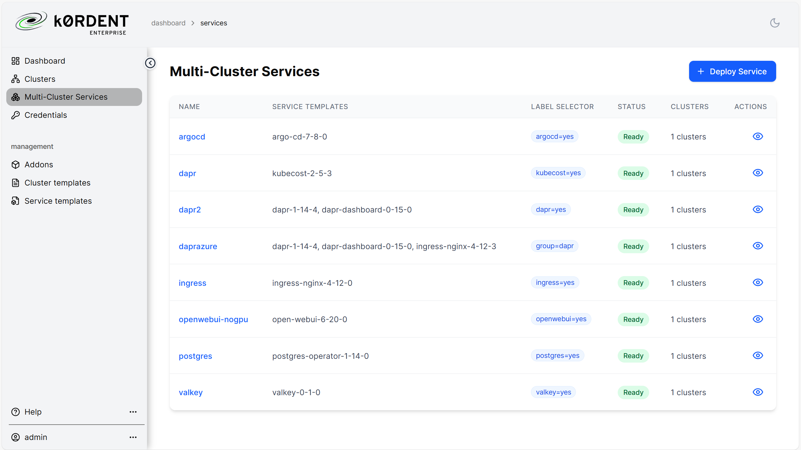

You can see what template was used and also the number of clusters on which it's running.  To create a new service, click `+ Deploy Service`.

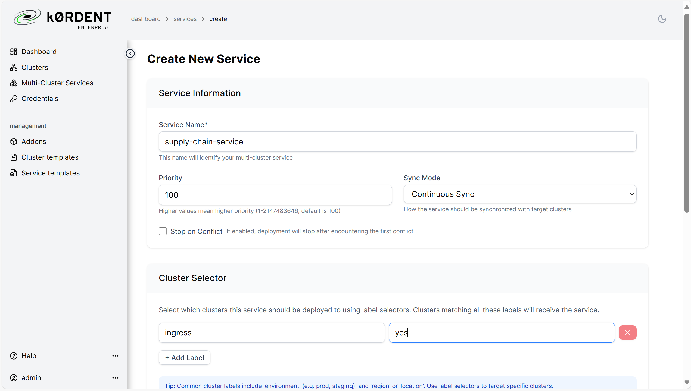
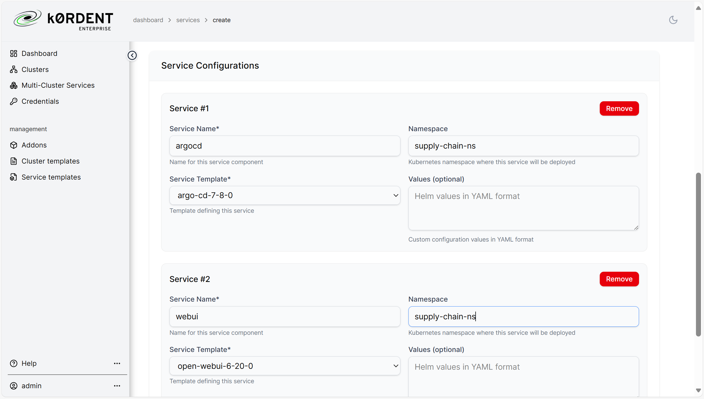
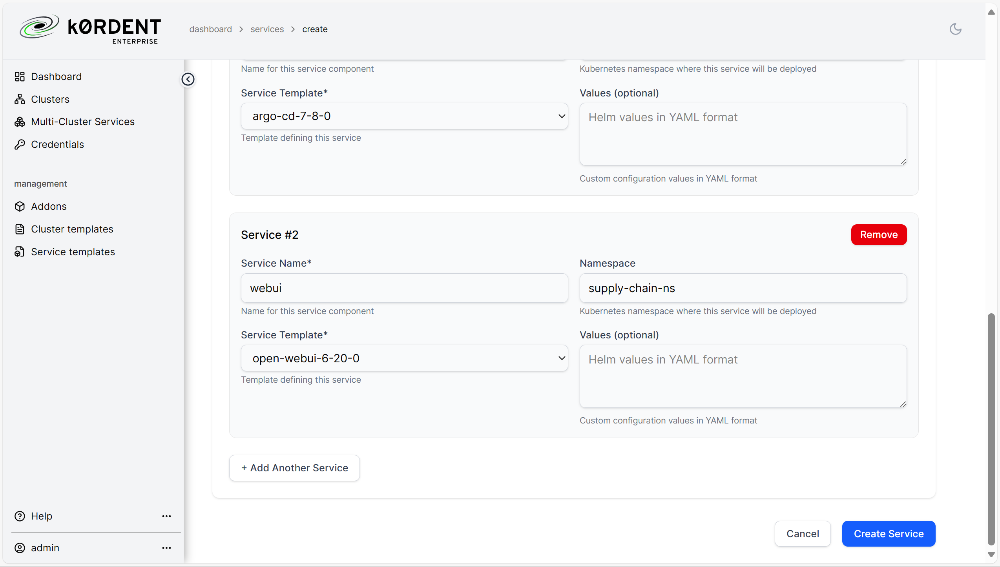

Specify the name for the service; it will be used to create the Kubernetes resources such as pods. Specify the priority; should it pre-empt other services if necessary, or "step aside" if resources are short?  In addition, when a serivce is propagated to multiple clusters, should that synchronization happen continuousy or just once?  You can also force a sync if things have changed.

If you have specific requirements for a cluster (for example, a cluster that has an `Ingress` installed, or a cluster in the development environment) you can set the value of tags that must be present on a cluster before the application is deployed there.

A note about these tags: they are completely arbitrary. There is no special intelligence involved in them. A cluster that has the `ingress=true` tag has that value because it's been deliberately set, not because an `Ingress` has been installed.

You can then add one or more applications based on a Service Template.  Click `+ Add Another Service` to add an additional service to the application.

Click `Create Service` to deploy the application.

You can see the new service on the Services list. 

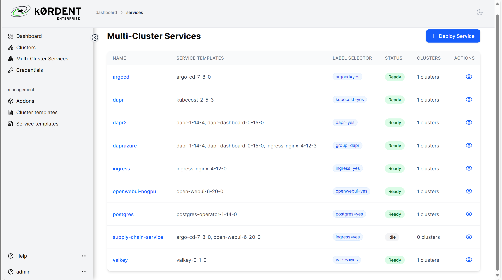

 Click the name of the service to get details.

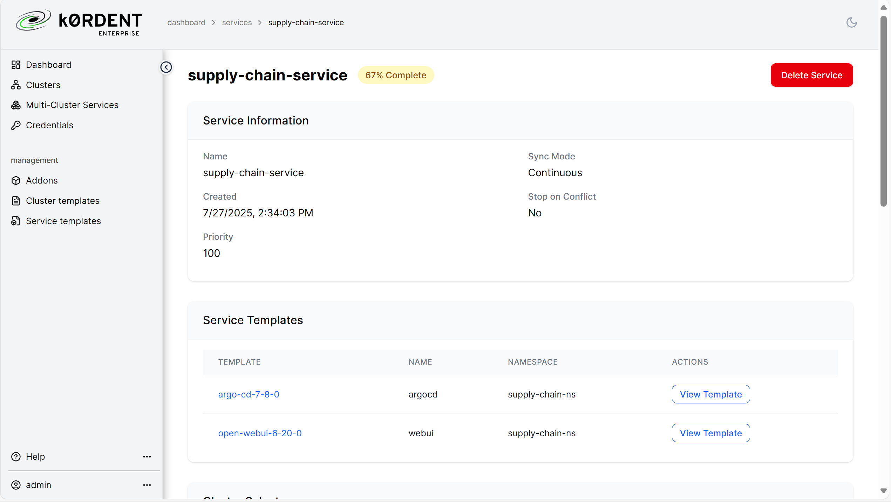
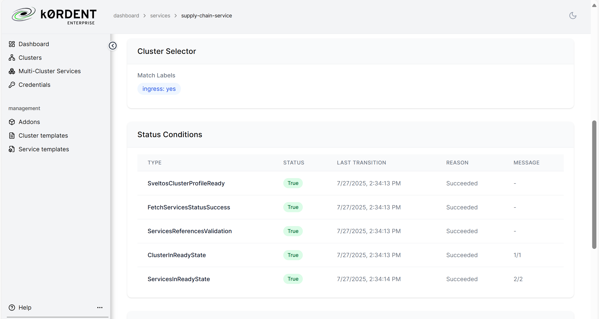
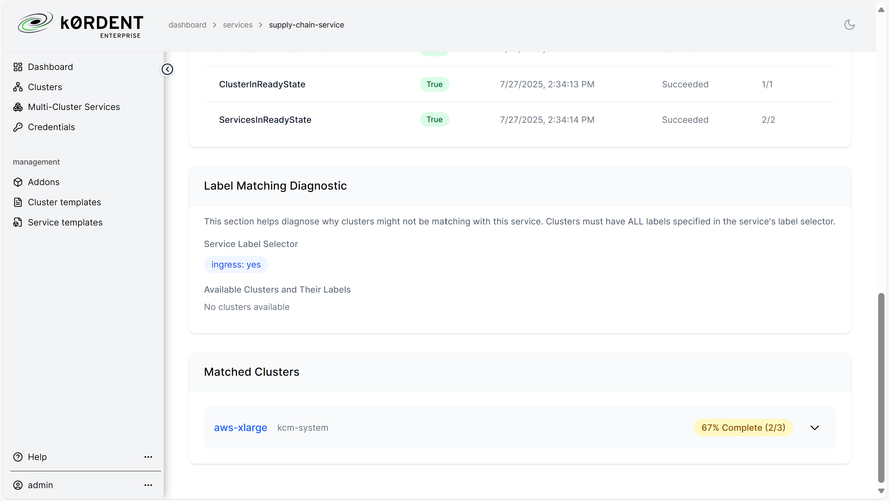

The details page shows the parameters for the service, as well as the latest events and information on the clusters on which it can run.

To remove a service, click the `Delete Service` button.

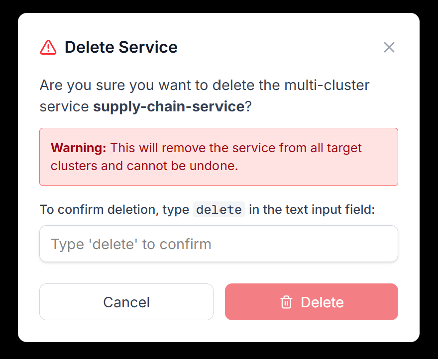

Once you confirm the deletion, {{{ docsVersionInfo.k0rdentName }}} will remove the service, leaving the Service Template intact.

## Credentials

Typically there are two types of credentials: provider credentials (such as those needed to create and manage servers, networking, and so on), and cluster credentials used to manage clusters themselves.

Although credentials must be [created directly in the {{{ docsVersionInfo.k0rdentName }}} management cluster](k0rdent-ui-config.md#credentials), the UI gives you the ability to see what credentials are available.

## Addons

{{{ docsVersionInfo.k0rdentName }}} comes pre-integrated with an entire catalog of useful services such as ArgoCD, Calico Networking, and Weights & Biases.  To see what's available, click the `Addons` link in the left-hand pane.

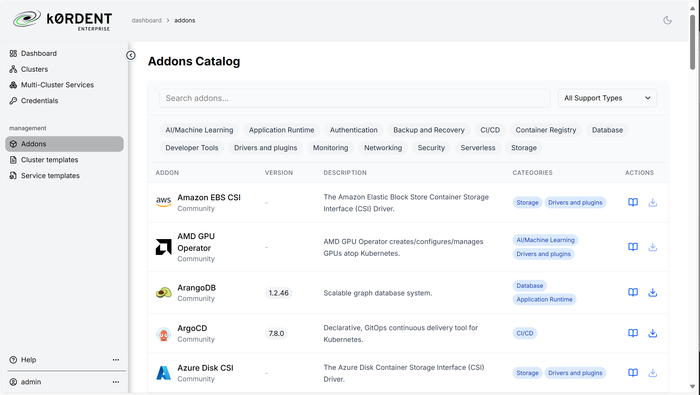

To add one of these services to your {{{ docsVersionInfo.k0rdentName }}} environment, click the `Add Template` link at the end of the line.

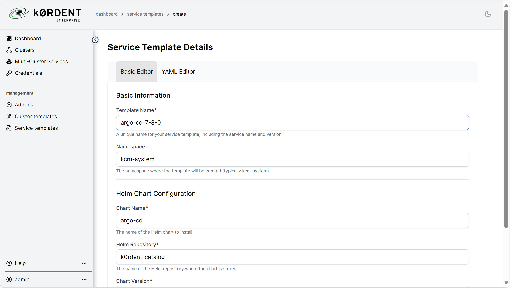

From here you can set the parameters for the Service Template that gets added to {{{ docsVersionInfo.k0rdentName}}}.  You'll use this tempate to create services.  

Set the name to something meaningful to you, but in this case you likely don't want to change any of the template values such as the chart name or helm repository, as they point to actual resources {{{ docsVersionInfo.k0rdentName }}} uses to create the service.

If you do need to make detailed changes, you can also click the `YAML Editor` tab.

From here you can edit the YAML directly, editing advanced parameters such as the `reconcileStrategy`, Kubernetes version requirements, or even the providers on which the service can be instantiated.

Click `Create`.

### Deploy a Service from a Template

Once you've created a Service Template, either directly or from the Addon Catalog, you can use it to deploy a service.  Click the `Service Templates` list in the left-hand pane.

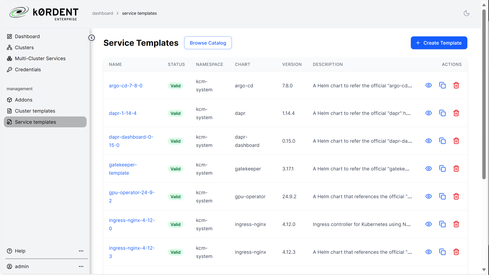

Click the Service Template you'd like to implement to see the details.

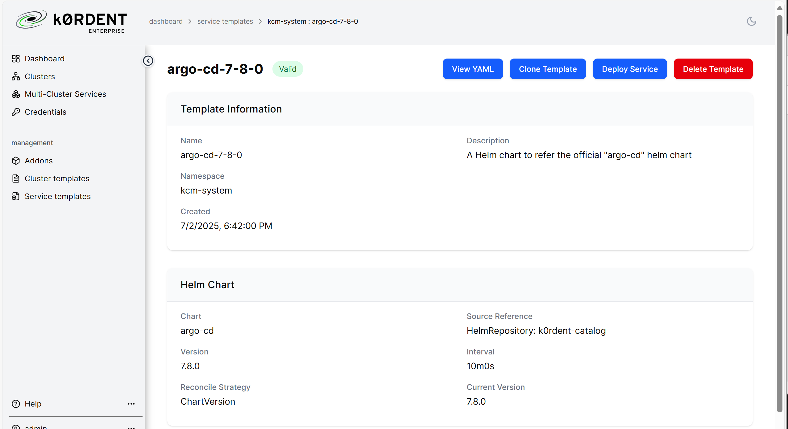

From here you can see the details of the Service Template, or you can click `View YAML` for more details.

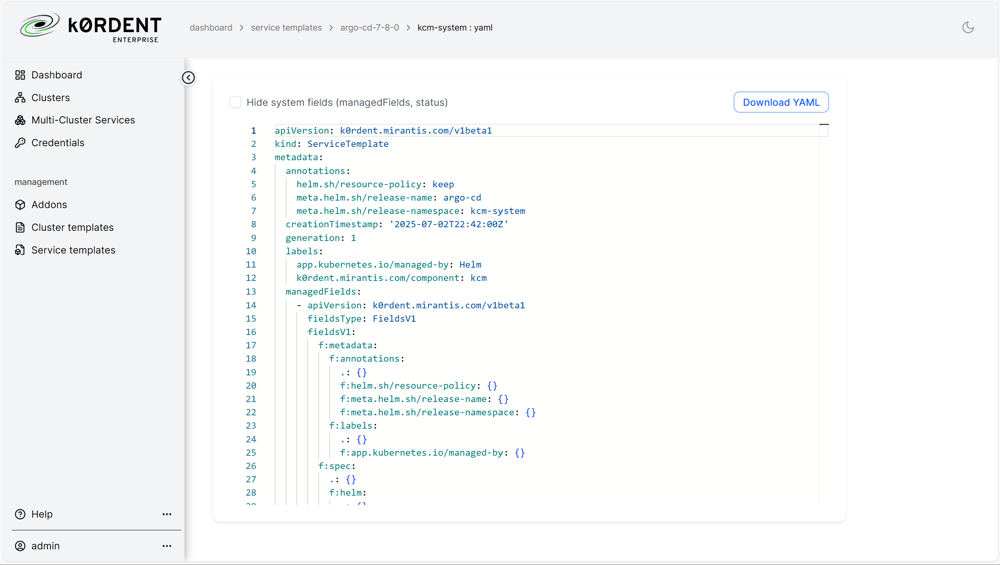

The YAML view lets you see existing details of the way in which the Service Template is implemented, but it also lets you download the YAML for the template itself. This can be particularly important if you are building your application based on Infrastructure as Code.

In addition, you can download the existing Service Template, make changes, and add it back to the system as a new template from which to create services.

To deploy a service from the template, go to the main Service Template information page and click `Deploy Service`.

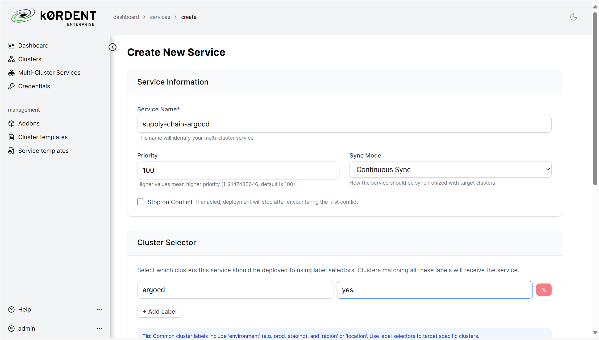

From here the process is the same as it was for [Multicluster Services](#multicluster-services).

## Cluster Templates

Templates are reusable, versioned cluster blueprints. Central to {{{ docsVersionInfo.k0rdentName}}} declarative approach, they combine references to a Helm chart with other information about how to handle the cluster and other provider-specific parameters.

In most cases, you won't need to create your own templates; {{{ docsVersionInfo.k0rdentName }}} comes with Cluster Template objects for deploying to most providers.  However, there can be situations in which you do want to create your own templates. For example, you may have internal infrastructure on which you want to deploy clusters; creating your own Cluster Template is one way to standardize that process for your users.

Start by clicking `Cluster Templates` in the left-hand pane.

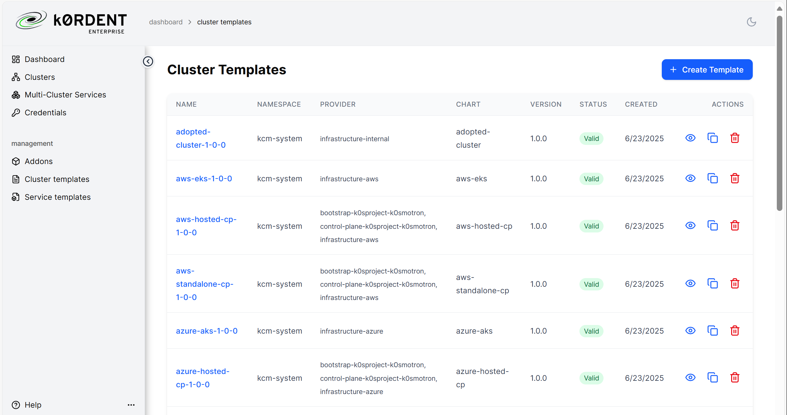

Click the `+ Create Template` button to bring up the Cluster Template editor.

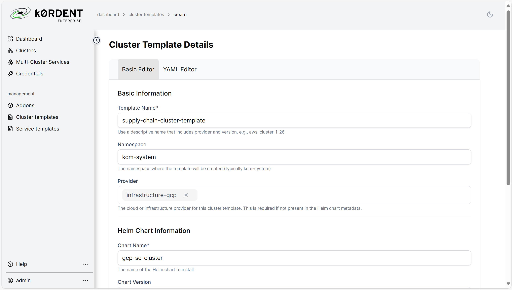

Name your template and the namespace in which you want that template to live. Note that the template does **not** have to be in the same namespace to which you deploy the actual cluster.

Specify the cloud or infrastructure provider on which these clusters will run. If the cluster will run on-premise, choose the `infrastructure-internal` provider.

You can also use the `YAML Editor` to directly make changes to the template definition.

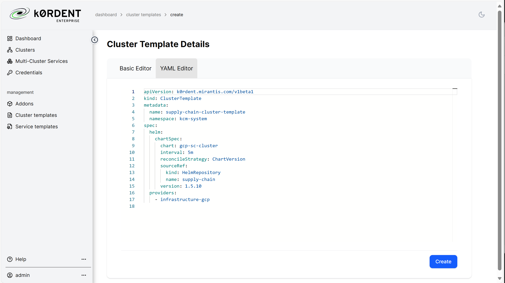

Click `Create` to create the template.

Once your template has been created, you can click `Create Cluster` on the template's information page to deploy a cluster based on that template.

## Conclusion

{{{ docsVersionInfo.k0rdentName }}} provides a comprehensive UI for managing Kubernetes infrastructure declaratively and at scale. Through an intuitive dashboard and clearly defined workflows, platform engineers can create, adopt, and manage clusters; deploy multi-cluster services; and maintain infrastructure consistency using reusable templates and pre-integrated add-ons. By standardizing the management of credentials, templates, and services, the UI enables efficient day-to-day operations across diverse environments.